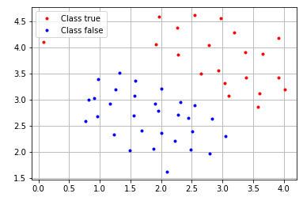
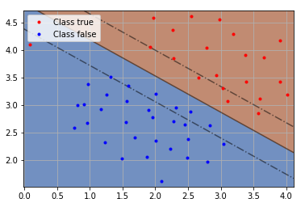
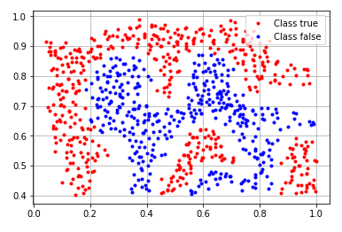
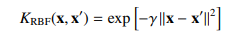
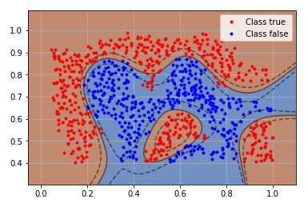
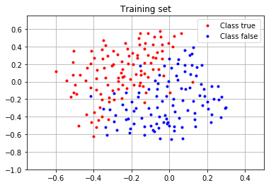
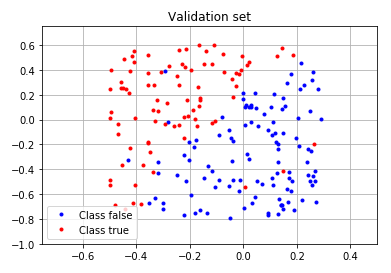
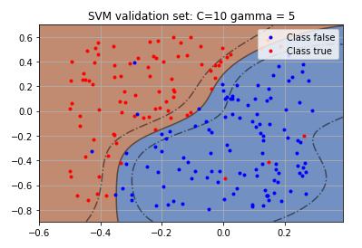
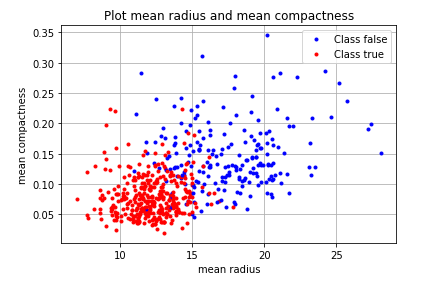

# ml_svm

**Experiments using SVM (support vector machines) with linear, Gaussian and other kernels.**

**Parameter tuning using train/test data split and k-folds.**

**Analysis of the Sklearn breast cancer data set to predict cancer using SVMs.**

To run the project:
```
git clone
pip install pandas matplotlib sklearn
jupyter notebook SupportVectorMachines.ipynb
```
Documentation is provided in code comments

## Dataset 1 - linear

A visualization of the data provided:

<p align="center">
  
</p>

The data appears linearly separable so I used a SVM with a linear kernel with the parameters below. I obtained the following separation plane that utilizes 12 support vectors which only mis-classified one data point.

```
kernel = 'linear'
gamma = 'auto'
C = 1
```
## Dataset 2 - gaussian

A visualization of the data provided:
<p align="center">
  
</p>

As the data did not appear linearly separable I used a Gaussian kernel  with the below parameters which were found experimentally.

```
kernel = 'rbf'
gamma = 10
C = 50
```

<p align="center">
  
</p>

This classified the data set using 170 support vectors and obtained an average precision and recall score of 0.96 respectively. The confusion matrix for this model is:
And the following confusion matrix:
```
          precision    recall  f1-score   support
0            0.94      0.98      0.96       383
1            0.98      0.95      0.97       480
avg / total  0.96      0.96      0.96       863
```


## Dataset 3 - test/train k-folds parameter tuning

This data set was pre-partitioned into two sets. One training set and one test set. A visualization is provided below.

<p align="center">
  
  
</p>

To find the correct parameters, we searched over the follow parameter space on the training data set. To do this, we used the Sklearn GridSearchCV which uses a k-folds splitting of the training data set.

```
kernel : 'rbf'
gamma : [0.1,1,5,10,20]
'C' : [1, 10, 100, 1000]
cv : 5
```

We obtained the following parameters and results.

```
Parameters chosen after 5 folds:
{'C': 10, 'gamma': 5}
Score of the model on training
0.919431279621
Score of the model on test
0.95
```

Plotting the separation plane:
<p align="center">
  
</p>

And the following confusion matrix:

```
               precision  recall  f1-score   support
0              0.96       0.96      0.96       113
1              0.94       0.94      0.94        87
avg / total    0.95       0.95      0.95       200
```

## Dataset 4 - Predicting breast cancer using 30 features.

This data set was obtained from the Sklearn data sets library. This data set contains 30 features of a cancer tumor, along with a malignant (1) or benign (0) class. A summary of the data in this data set:

```
feature                                 Min    Max
===================================== ====== ======
radius (mean):                        6.981  28.11
texture (mean):                       9.71   39.28
perimeter (mean):                     43.79  188.5
area (mean):                          143.5  2501.0
26 more...
```

A brief visualization of two features in this dataset:

<p align="center">
  
</p>

To build a prediction model, I first split the data set into a training and a test data set. This is so we ensure that the model is not simply over-fitting the data. I used a train-test split of **80:20**

Next, the data was scaled using **subtract mean / stdev** because SVMs are sensitive to the scale of the initial data.

Finally, I searched for optimal parameters using k-folds over the following parameter space:

```
'kernel' : ['rbf'],
'gamma' : [0.01, 0.1,1,5,10,20],
'C' : [ 1, 10, 100, 1000]
'cv' : 10
```
We obtained the following parameters and results. Interestingly, the model performed better on the test data than on the training data set.

```
Parameters chosen after 10 folds:
{'kernel': 'rbf', 'C': 10, 'gamma': 0.01}
Score of the model on training
0.978021978022
Score of the model on test
0.991228070175
```
This model generated the following confusion matrix:
```
              precision    recall  f1-score   support
No cancer      1.00      0.98      0.99        42
Cancer         0.99      1.00      0.99        72
avg / total    0.99      0.99      0.99       114
```
On average, our model classified 99% of the tumors.

**Extra note:**
When I searched for optimal parameters under a linear model, I also obtained a very accurate result. This was puzzling because a data set with as many features as 30 would suggest a more complex Gaussian kernel would be needed to capture the detail of the data.

This could suggest that predicting breast cancer tumors is perhaps a linear weighting of features rather than a more complex relationship

```
Parameters chosen after 10 folds:
{'kernel': 'linear', 'C': 1, 'gamma': 0.01}
Score of the model on training
0.971428571429
Score of the model on test
0.973684210526
```

The other issue I encountered was that k-folds parameter tuning varied between executions. This could be due to the random selection of data implemented by K-folds or the svc model. As the classification is near 100%, a small variation during training data selection will produce different parameters.
